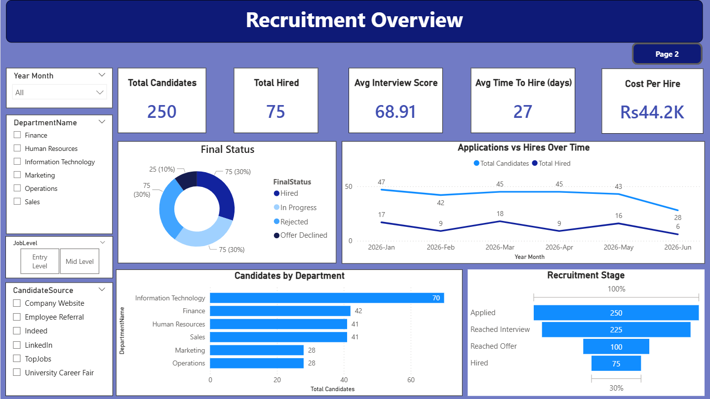
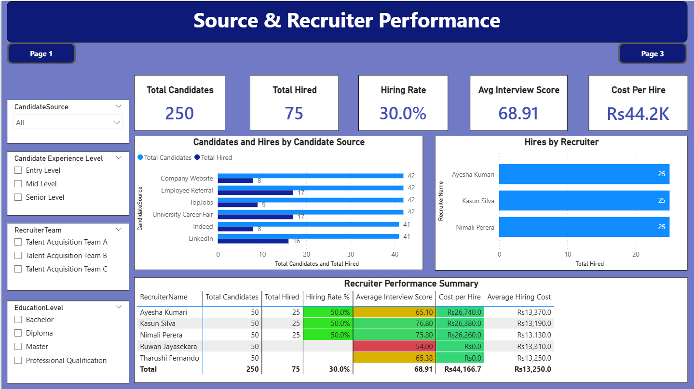
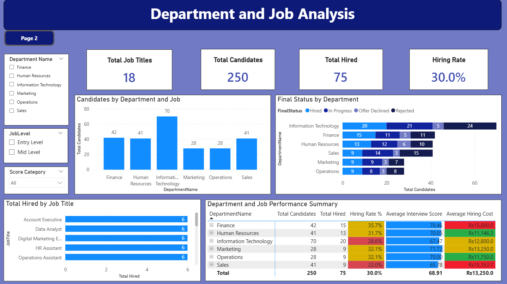

# Recruitment Analytics Dashboard

## Overview

This project presents an end-to-end HR Recruitment Analytics solution developed using MySQL and Power BI. The solution analyzes a 250-candidate recruitment dataset across 6 departments, 18 job roles, and 5 recruiters to identify recruitment trends, evaluate hiring performance, and support data-driven management decision-making.

The dashboard transforms the recruitment pipeline from application through interview, offer, and hiring into an interactive and filterable analytical view.

## Objectives

- Analyze recruitment and hiring performance across departments, job roles, and recruiters.
- Track key recruitment KPIs such as Hiring Rate, Time to Hire, Cost per Hire, and Average Interview Score.
- Evaluate candidate sourcing channels and their hiring performance.
- Identify recruitment trends and performance patterns.
- Compare hiring performance and costs across departments and job roles.
- Provide interactive dashboards and data-driven insights to support management decision-making.

## Dataset

- Dataset: HR Recruitment Dataset
- Records: 250 recruitment records
- Departments: 6
- Job Roles: 18
- Recruiters: 5
- Talent Acquisition Teams: 3
- Job Levels: Entry Level and Mid Level

The dataset contains information related to:

- Candidate source
- Education level
- Experience level
- Job title
- Department
- Recruiter
- Interview score
- Hiring cost
- Final recruitment status
- Recruitment dates

The dataset was synthetically generated using a SQL stored procedure to create realistic recruitment pipeline records.

## Database & Data Model

The data was prepared and managed using **MySQL through XAMPP**.

A star-schema database was designed consisting of:

- 1 fact table: `fact_recruitment`
- 4 dimension tables:
  - `dim_department`
  - `dim_job`
  - `dim_candidate`
  - `dim_recruiter`

Primary key and foreign key constraints were used to establish relationships between the fact and dimension tables.

The five tables were imported into Power BI using the native MySQL connector. Active one-to-many relationships were established in the Power BI data model, together with a DAX date table for time-based analysis and time intelligence.

## Data Preparation & Analytics

The project involved:

- Designing the relational database schema.
- Creating fact and dimension tables.
- Defining primary and foreign key relationships.
- Generating synthetic recruitment records using a SQL stored procedure.
- Importing MySQL tables into Power BI.
- Building the Power BI star-schema model.
- Creating a DAX date table for time analysis.
- Developing DAX measures for dynamic recruitment KPIs.
- Building interactive dashboards for recruitment performance analysis.

## Key KPIs

The dashboard provides dynamic KPI calculations for:

- Total Candidates
- Total Hired
- Hiring Rate
- Average Interview Score
- Average Time to Hire
- Average Cost per Hire

### Overall Results

- **Total Candidates:** 250
- **Total Hired:** 75
- **Hiring Rate:** 30.0%
- **Average Interview Score:** 68.91
- **Average Time to Hire:** 27 days
- **Average Cost per Hire:** LKR 44,200

## Dashboard Features

### 1. Recruitment Overview

Provides a high-level view of overall recruitment performance, including:

- Recruitment KPIs
- Final recruitment status
- Applications and hires over time
- Candidates by department
- Recruitment stage analysis
- Interactive filtering by year/month, department, job level, and candidate source

### 2. Source & Recruiter Performance

Analyzes recruitment source and recruiter effectiveness through:

- Candidates and hires by candidate source
- Hiring rate
- Recruiter-level hiring performance
- Average interview scores
- Cost per hire
- Recruiter performance summary
- Filtering by candidate source, experience level, recruiter team, and education level

### 3. Department & Job Analysis

Provides detailed analysis of recruitment performance across departments and job roles, including:

- Candidates by department
- Final recruitment status by department
- Hires by job title
- Hiring rate by department
- Average interview score
- Average hiring cost
- Department and job-level performance summary
- Interactive filtering by department, job level, and score category

## Interactive Features

The Power BI dashboard includes:

- Interactive filtering and slicers
- Drill-down analysis
- Drill-through functionality
- Tooltips
- Dynamic KPI calculations
- Time-based analysis
- Interactive page navigation
- Department, job, recruiter, and candidate-source analysis

## Key Insights

The analysis identified several recruitment performance patterns:

- Information Technology and Finance together accounted for **35 of the 75 hires**, representing nearly half of total hires.
- Employee Referral, LinkedIn, and University Career Fair were the strongest candidate sources, with approximately **40% hiring rates**, around twice the rates of Company Website, TopJobs, and Indeed.
- Marketing and Human Resources had the fastest average hiring process at **26 days**, while Sales had the slowest at **29 days**.
- Sales had the highest average hiring cost among departments.
- Human Resources had the lowest average hiring cost and cost per hire, making it the most cost-efficient department.
- Marketing candidates recorded the highest average interview score among the departments.

These findings were used to identify recruitment trends and performance differences and support data-driven recommendations for improving recruitment effectiveness and management decision-making.

## Tools & Technologies

- MySQL
- XAMPP
- Microsoft Power BI
- DAX
- SQL
- Data Modeling
- Data Cleaning
- Data Visualization
- Business Intelligence
- KPI Development

## Key Learning

This project provided practical experience in building an end-to-end recruitment analytics solution, from relational database design and SQL-based data preparation to star-schema modeling, DAX-based KPI development, interactive Power BI dashboard development, and business-oriented analysis.

It also strengthened practical skills in transforming recruitment data into actionable insights for management decision-making.

## Dashboard Demo

🎥 [Watch the Recruitment Analytics Dashboard Demo](https://youtu.be/JShn64oAmDI)

A 2-minute 50-second demonstration of the interactive Power BI dashboard, covering recruitment overview, source and recruiter performance, and department and job analysis.

## Note

The original Power BI (.pbix) file is not publicly shared. Dashboard screenshots are provided to demonstrate the project's analytical, visualization, and reporting capabilities.
